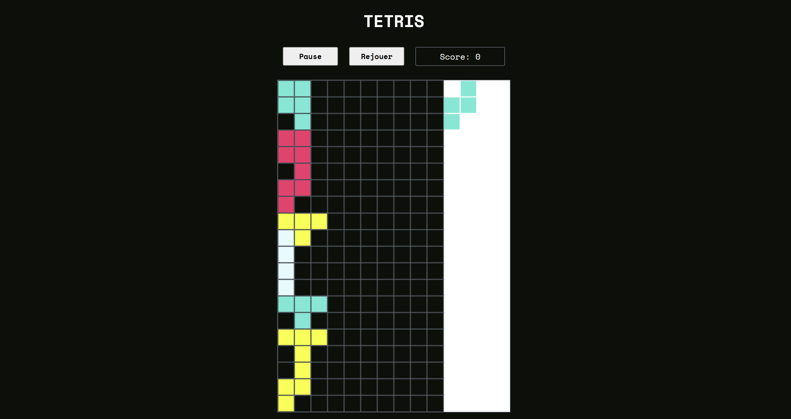

# TETRIS 

- Tetris est un jeu vidéo qui a été créé en 1984.

- Jouer au jeu : [Tetris](https://jeu-tetris.netlify.app/). 

- Ce jeu a été codé en JavaScript. Il convient de jouer avec les flèches du clavier de l'ordinateur. 

 

---- 

## Objectif du jeu 

- Il convient d'empiler des pièces de différentes formes (Tetriminos) pour créer des lignes complètes. 

- Lorsque vous remplissez une ligne, elle disparaît, ce qui vous permet de gagner des points et de créer de l'espace pour d'autres pièces. 

- Le jeu continue jusqu'à ce que les pièces atteignent le haut de l'écran, ce qui entraîne la fin de la partie.

## Règles du jeu

### 1. Les pièces : 

- quatre blocs de différentes formes : I, O, T, J, L, S et Z.
- Chaque pièce apparaît dans une couleur différente.

### 2. Contrôle des pièces :

- Les pièces tombent du haut de l'écran et descendent progressivement vers le bas
- Le joueur peut déplacer les pièces vers la gauche ou la droite, les faire tourner et les faire descendre plus rapidement avec les flèches du clavier. 

### 3. Formation des lignes : 

- Lorsqu'une ligne est complètement remplie de blocs (sans espaces vides), elle disparaît. La disparition d'une ou plusieurs lignes vous donne des points

### 4. Niveau de difficulté :

- À mesure que vous progressez, la vitesse à laquelle les pièces tombent augmente, rendant le jeu plus difficile.

### 5. Fin du jeu : 

- Le jeu se termine lorsque les pièces atteignent le haut de l'écran et qu'il n'y a plus d'espace pour faire tomber une nouvelle pièce.

