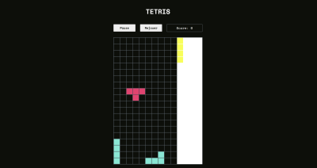
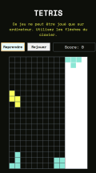

# TETRIS 

Tetris est un jeu vidéo qui a été créé en 1984. Ce jeu a été codé en JavaScript et est déployé sur Netlify: **[🔗 jouer en ligne à Tetris](https://jeu-tetris.netlify.app/)**
 
⚠️ **Ce jeu est optimisé pour ordinateur** car il nécessite de jouer avec les flèches du clavier de l'ordinateur. Il n'est pas jouable sur mobile ou tablette.

---

## Aperçu 

<div style="display: flex; gap: 2rem;">
  
  
</div>

---- 


## 1. Objectif du jeu 

Il convient d'empiler des pièces de différentes formes (Tetriminos) pour créer des lignes complètes. 

Lorsque vous remplissez une ligne, elle disparaît, ce qui vous permet de gagner des points et de créer de l'espace pour d'autres pièces. 

Le jeu continue jusqu'à ce que les pièces atteignent le haut de l'écran, ce qui entraîne la fin de la partie.


## 2. Règles du jeu

### 2.1. Les pièces : 

- quatre blocs de différentes formes : I, O, T, J, L, S et Z.
- Chaque pièce apparaît dans une couleur différente aléatoirement. 

### 2.2. Contrôle des pièces :

Les pièces tombent du haut de l'écran et descendent progressivement vers le bas.

Le joueur peut déplacer les pièces vers la gauche ou la droite, les faire tourner et les faire descendre plus rapidement **avec les flèches du clavier**. 

### 2.3. Formation des lignes : 

Lorsqu'une ligne est complètement remplie de blocs (sans espaces vides), elle disparaît. La disparition d'une ou plusieurs lignes vous donne des points

### 2.4. Niveau de difficulté :

À mesure que vous progressez, la vitesse à laquelle les pièces tombent augmente, rendant le jeu plus difficile.

### 2.5. Fin du jeu : 

Le jeu se termine lorsque les pièces atteignent le haut de l'écran et qu'il n'y a plus d'espace pour faire tomber une nouvelle pièce.

--- 


## 3. Installation 

### 3.1. Cloner le projet : 
  ```
   git clone https://github.com/Melissa-code/tetris.git
   cd tetris
   Ouvrir le fichier `index.html` dans le navigateur pour commencer à jouer
  ```

### 3.2. Technologies : 

- **HTML** : Structure du jeu
- **CSS** : Design et mise en page
- **JavaScript** : Logique du jeu (création des pièces, gestion des collisions, score, etc.)
- **Canvas API** : Rendu du jeu


### 3.3. Architecture et patterns : 

#### Architecture 

📂 **tetris**  
 ┣ 📜 **index.html** → Structure principale du jeu  
 ┣ 📜 **style.css** → Styles et mise en page  
 ┣ 📂 **models** → Contient les classes du jeu  
 │ ┣ 📜 **Bloc.js** → Représente un bloc individuel dans une pièce  
 │ ┣ 📜 **Fabrique.js** → Gère la création des pièces (Tetriminos)  
 │ ┣ 📜 **PlateauJeu.js** → Gère le plateau de jeu, la détection des collisions et le score  
 │ ┗ 📜 **couleurs.js** → Enum des couleurs des blocs  
 ┣ 📜 **Vue.js** → Gère l'affichage du jeu et les interactions utilisateur  
 ┗ 📜 **main.js** → Point d’entrée, initialise le jeu et la logique principale  
 ┗ 📜 **images** → Contient les illustrations du jeu


#### Patterns utilisés

- **MVC (Model-View-Controller)**  
  - `models/` contient la logique du jeu (Modèle).  
  - `Vue.js` s’occupe de l'affichage (Vue).  
  - `main.js` fait le lien entre les modèles et la vue (Contrôleur)

- **Factory Pattern**  
  - `Fabrique.js` est une **fabrique** qui crée les différentes pièces du jeu (Tetriminos).  

---


## Author 

- Melissa-code